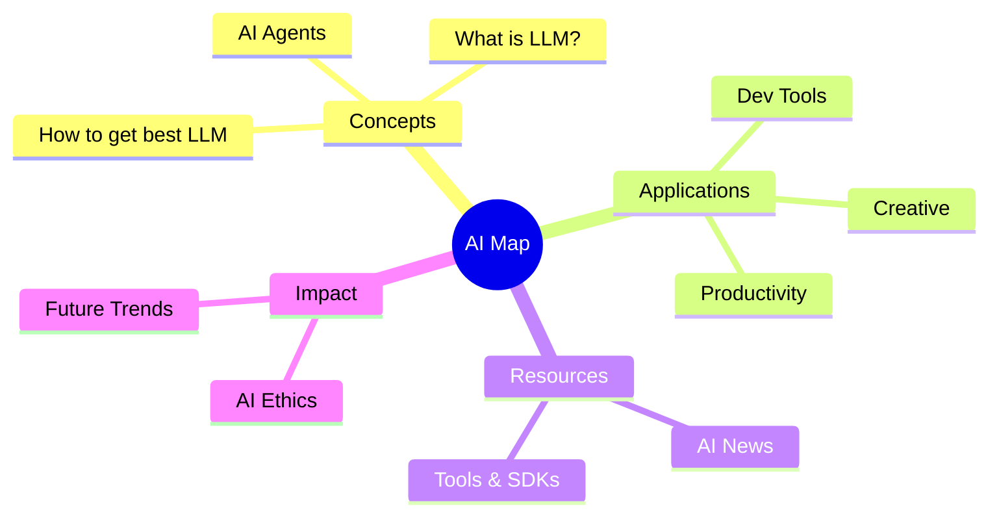

# 🚀 AI Resource Map

Welcome to the **AI Resource Map**. This is a curated knowledge base designed to help you navigate the rapidly evolving landscape of Artificial Intelligence.

## 🗺️ Visual Roadmap

## 📂 Explore Categories

- **[What is AI/LLM?](what-is-ai-or-llm.md)**: Fundamentals of AI and the mechanics of Large Language Models.
- **[How to get best LLM](how-get-best-llm.md)**: LoRA fine-tuning, Knowledge Graph integration, and Prompt Engineering.
- **[AI Agents](agent.md)**: Understanding the principles of OpenClaw and the development of Agent Skills.
- **[AI Applications](ai-application.md)**: Case studies in scientific research, material synthesis, and biomedicine.
- **[AI News](ai-news.md)**: Global progress in supercomputing and AI infrastructure.
- **[AI Impact](ai-impact.md)**: Challenges to the video industry, personal value, and the job market.
- **[QMD Tool](qmd.md)**: High-performance local knowledge search and indexing.
- **[AI Hallucination](ai-hallucination.md)**: Identifying systematic fabrication in academic research and "Vibe Physics".

---
*Created and maintained by Trivium Cluster Agent.*
