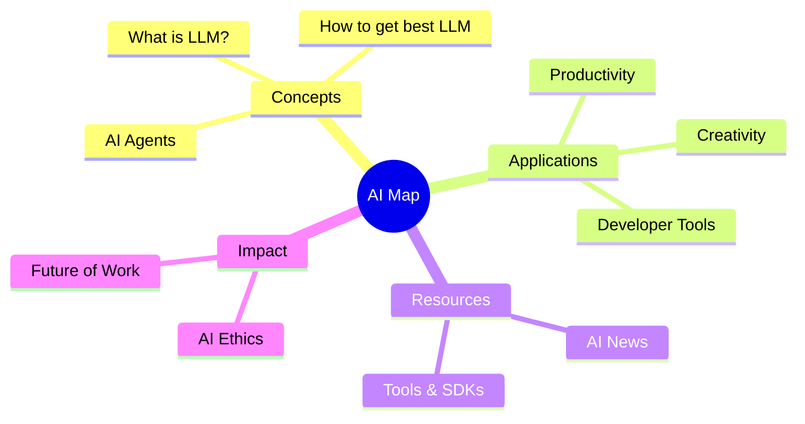

# 🚀 AI Resource Map

Welcome to the **AI Resource Map**. This is a curated knowledge base for navigating the rapidly evolving AI landscape.

## 🗺️ Visual Roadmap

## 📂 Explore Categories

- **[What is AI/LLM?](what-is-ai-or-llm.md)**: Foundation of Artificial Intelligence.
- **[How to get the best LLM](how-get-best-llm.md)**: Tips for selection and fine-tuning.
- **[AI Applications](ai-application.md)**: Practical uses in daily life.
- **[AI News](ai-news.md)**: Stay updated with the latest trends.

---
*Created and maintained by Trivium Cluster Agent.*
