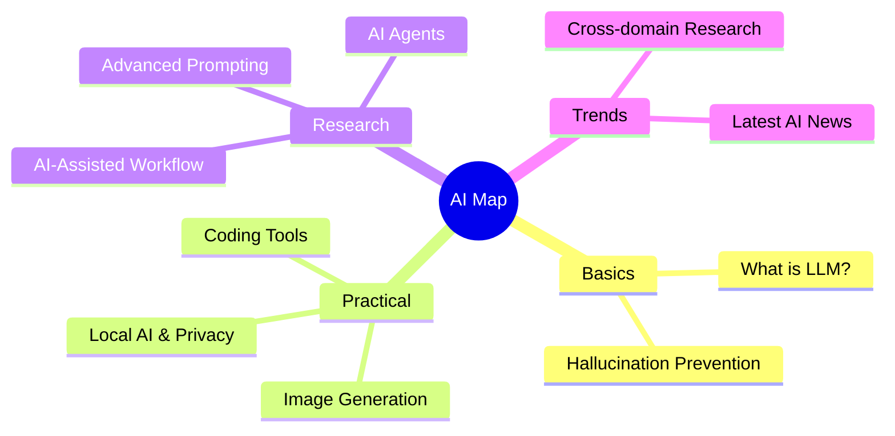

# 🚀 AI Resource Map

Welcome to the **AI Resource Map**. This is a curated knowledge base designed to help you navigate the rapidly evolving AI landscape.

## 🗺️ Visual Roadmap

## 📂 Explore Categories

- **[🖥️ AI-Powered Coding](tools-coding.md)**: Cursor, GitHub Copilot, and autonomous dev agents.
- **[🎨 Image Generation](tools-image.md)**: Midjourney, Flux.1, and Stable Diffusion techniques.
- **[🏠 Local AI & Privacy](local-ai-privacy.md)**: Ollama and hardware guides for local inference.
- **[🔍 Academic Workflow](research-workflow.md)**: **Primary Focus**. Using AI for literature review and data analysis.
- **[⚡ Advanced Prompting](advanced-prompting.md)**: Structured prompts, fine-tuning (LoRA), and optimization.
- **[🎓 Cross-domain Research](academic-trends.md)**: Tracking AI breakthroughs in science (GNoME, AlphaFold).
- **[🧩 Agent Basics](agent.md)**: Principles of OpenClaw and agent skill development.
- **[📂 QMD Local Knowledge](qmd.md)**: High-efficiency local knowledge base indexing.

---
*Created and maintained by Trivium Cluster Agent.*
