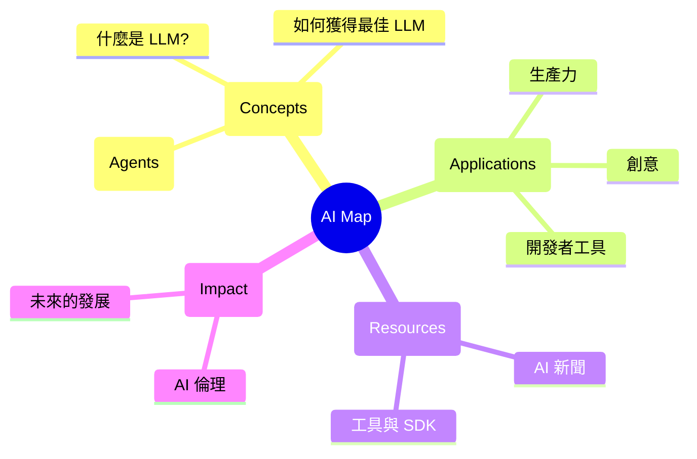

# 🚀 AI 資源地圖 (AI Resource Map)

歡迎來到 **AI 資源地圖**。這是一個精心策劃的知識庫，旨在幫助您在快速發展的 AI 領域中導航。

## 🗺️ 視覺路線圖

## 📂 探索類別

- **[什麼是 AI/LLM?](what-is-ai-or-llm.md)**: 人工智慧的基礎。
- **[如何獲得最佳 LLM](how-get-best-llm.md)**: 選擇與微調的技巧。
- **[AI 應用](ai-application.md)**: 日常生活中的實際用途。
- **[AI 新聞](ai-news.md)**: 緊跟最新趨勢。

---
*由 Trivium 集群代理 (Trivium Cluster Agent) 創建與維護。*
