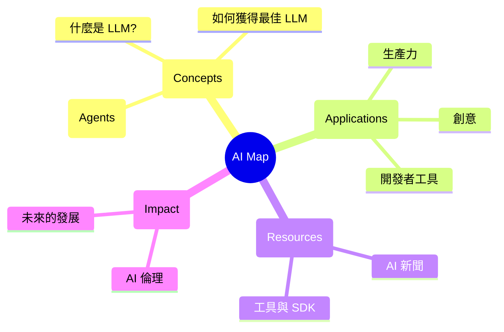

# 🚀 AI 資源地圖 (AI Resource Map)

歡迎來到 **AI 資源地圖**。這是一個精心策劃的知識庫，旨在幫助您在快速發展的 AI 領域中導航。

## 🗺️ 視覺路線圖

## 📂 探索類別

- **[什麼是 AI/LLM?](what-is-ai-or-llm.md)**: 人工智慧與大型語言模型的運作機制與基礎。
- **[如何獲得最佳 LLM](how-get-best-llm.md)**: LoRA 微調、知識圖譜結合與提示詞工程技巧。
- **[AI 代理 (Agents)](agent.md)**: 深入了解 OpenClaw 與代理技能的開發原理。
- **[AI 應用](ai-application.md)**: AI 在科學研究、材料合成與生物醫學的具體案例。
- **[AI 最新動態](ai-news.md)**: 全球超級電腦與 AI 基礎設施的進展。
- **[AI 社會影響](ai-impact.md)**: 對影片產業、個人價值與就業市場的挑戰。
- **[QMD 工具](qmd.md)**: 高效的本地知識庫搜尋與索引工具。
- **[AI 幻覺與造假](ai-hallucination.md)**: 識別學術研究中的系統性造假與 Vibe Physics。

---
*由 Trivium 集群代理 (Trivium Cluster Agent) 創建與維護。*
