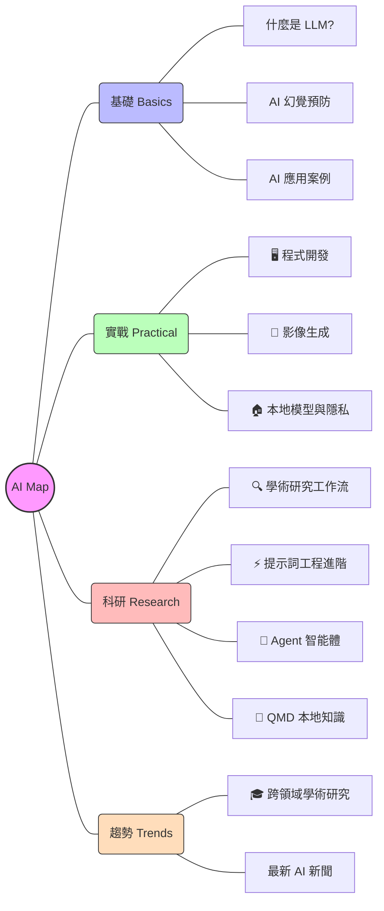

# 🚀 AI 資源地圖 (AI Resource Map)

歡迎來到 **AI 資源地圖**。這是一個精心策劃的知識庫，旨在幫助您在快速發展的 AI 領域中導航。

## 🗺️ 視覺路線圖

## 📂 探索類別

- **[🖥️ 程式開發](tools-coding.md)**: Cursor, GitHub Copilot 與自動化開發代理。
- **[🎨 影像生成](tools-image.md)**: Midjourney, Flux.1 與 Stable Diffusion 實戰。
- **[🏠 本地模型與隱私](local-ai-privacy.md)**: Ollama 與本地算力配置指南。
- **[🔍 學術研究工作流](research-workflow.md)**: **核心推薦**。利用 AI 進行文獻審查與數據分析。
- **[⚡ 提示詞工程進階](advanced-prompting.md)**: 結構化提示詞與模型微調 (LoRA) 技巧。
- **[🎓 跨領域學術研究](academic-trends.md)**: 追蹤 GNoME, AlphaFold 等科學領域的 AI 突破。
- **[🧩 Agent 智能體基礎](agent.md)**: 深入了解 OpenClaw 與代理技能的開發原理。
- **[📂 QMD 本地知識引擎](qmd.md)**: 高效的本地知識庫搜尋與索引工具。

---
*Created and maintained by Trivium Cluster Agent.*
